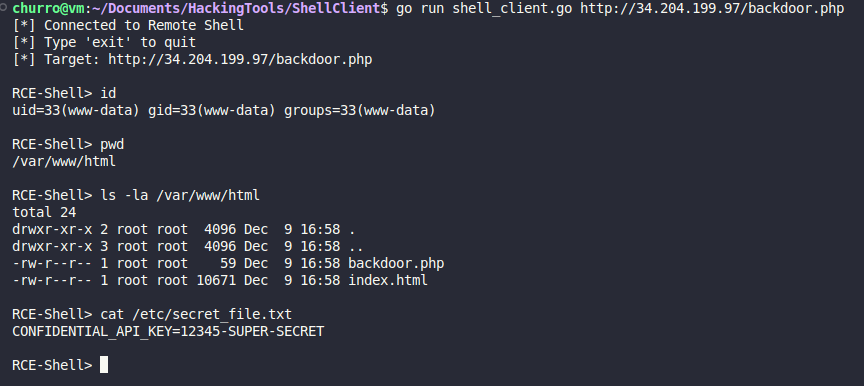

# NetSec Tools & Cloud Lab

## 🚀 About the Project
This is a documentation of my journey on building custom cybersecurity tools from scratch. I wanted to understand how pre-made tools worked so I made my own versions in **Go (Golang)** and **Python** to understand how stuff like TCP, HTTP Ethernet work.

I also used **Terraform** to architect a custom "Vulnerable Lab" scenario in AWS to test these tools in a real-world cloud environment.

## 🛠️ The Toolkit
### 1. TCP/IP Sniffer (Python)
* **What it does:** Captures raw packets, decodes Ethernet/IP/TCP headers, and identifies flags (SYN, ACK, FIN).
* **Tech:** Raw Sockets, Struct unpacking.

### 2. Concurrent Port Scanner (Go)
* **What it does:** Scans a target subnet for open ports using high-concurrency Goroutines (a faster way than sequential scanning).
* **Features:** Service Banner Grabbing, Timeout handling.

### 3. HTTP Directory Buster (Go)
* **What it does:** Brute-force web paths to find a hidden admin panel or backdoor (e.g `backdoor.php`).
* **Tech:** HTTP Clinet, Worker Pools.

### 4. Remote Shell Client (Go)
* **What it does:** Connects to a remote PHP backdoor and provides an interactive terminal for Command Injection.

### 5. HoneyPort (Go)
* **What it does:** A lightweight honeypot that listens on specific ports (e.g., 8080)
* **Defense Mechanism:** Detects connection attempts, logs the attacker's IP, and sends a fake "Vulnerable Admin" banner to waste their time.
* **Usage:** `go run tools/HoneyPort/honeyport.go 8080`

### 6. Reverse Shell (C2)
* **What it does:** A custom Command & Control framework consisting of a Listener (Server) and a Payload (Implant).
* **Architecture:**
    * **Implant:** Connects back to the server (Reverse TCP), redirects `stdin`/`stdout` to the socket, and includes a persistence loop to reconnect if the link is dropped.
    * **Server:** Listens for incoming connections and provides an interactive shell to control de victim.
* **Usage:**
    * **Server:** `go run tools/ReverseShell/server/server.go`
    * **Implant:** `go run tools/ReverseShell/implant/implant.go <SERVER_IP:PORT>`

### 7. Ransomware Simulator (The Locker)
* **What it does:** Simulates a ransomware attack by encrypting files in a target directly using AES-256 (GCM Mode).
* **Key Features:**
    * **Encryption:** Uses Go's `crypto/aes`and `crypto/cipher` packages.
    * **Safety First:** Hardcoded to ONLY operate inside a local `sandbox/` directory to prevent accidental data loss.
    * **Decryptor:** Includes a counterpart tool to restore files if the correct key is provided.
* **Usage:**
    * **Lock:** `go run tools/locker/locker.go` (Prints the decryption key)
    * **Unlock:** `go run tools/unlocker/unlocker.go <KEY_HEX>`

## ☁️ Infrastructure as Code (Terraform)
I built two environments in AWS:
1. **The Fortress:** A locked-down EC2 instance allowing SSH only from my specific IP.
2. **The Target:** A deliberately vulnerable Web Server with an RCE injection point.

## Screenshots

*Capturing raw TCP handshake packets.*

*Remote Code Execution via custom Go client.*

## ⚠️ Disclaimer
These tools are for educational purposes and authorized security testing only. I am not responsible for your actions.